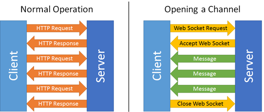

# 웹소켓
> **기존 웹 페이지의 브라우저 통신 및 렌더링 방식**  
> - Http 요청 및 응답을 사용한 방식  
> - 브라우저를 새로고침하여 전체를 렌더링해서 클라이언트 브라우저에 표현한다  
> - 요청이 있어야만 응답을 준다  

> **비동기 통신 발달**  
> - 원하는 부분만 실시간으로 상호 데이터를 교환하여 새로고침 없이 렌더링(Ajax)  

> **웹 소켓 등장**  
> - 클라이언트 브라우저와 웹 서버 사이에서 양방향 메세지 송수신 기술  
> - 양방향 모두 언제든지 요청 가능  

  

# Channels
파이썬용 websocket 모듈  
```
pip install websocket
```  
Django는 요청이 들어오면 응답하고, 다음 요청을 기다리는 방식을 사용, 이 때문에 사용이 불편하다. 이를 원활하게 해주는 **'Channels'**가 존재  
> **Channels**  
> Django를 사용하는 프로젝트로 HTTP를 너머 웹소켓, 채팅 프로토콜, IoT 프로토콜 등을 다룰 수 있다. 그것은 ASGI라고 불리는 파이썬 사양을 기반으로 만들어졌다.  

> ASGI : web server와 django, 애플리케이션을 연결해주는 Python의 표준 API  

# Customer  
장고에서 Http 요청을 받을 때, URLconf를 통해 view를 차아가는 것과 비슷하게, Channels가 웹 소켓 연결을 받아들일 때, routing configuration을 통해 customer를 찾는다. 연결로부터 오는 이벤트를 다루기 위해 consumer에 있는 다양한 기능들을 호출  
|환경|함수|
|:---:|:---:|
|**Django**|Chnnels|
|**URLconf**|Routing configuration|
|**views**|consumer|  

# Channel Layer  
communication 시스템의 한 종류. 여러 사람이 소통하는 것을 가능하게 해준다. channel layer는 두가지 abstractions을 제공한다.  
- **channel** : 메세지를 보낼 수 있는 메일박스, 각각의 채널은 이름을 갖는다. 채널의 이름을 가진 누구든지 channel에 메세지를 보낼 수 있다.  
- **group** : 연관된 채널의 그룹을 의미한다. 그룹 또한 이름을 가진다. 그룹의 이름을 가진 누구든지 그룹에 채널을 삭제/추가 할 수 있다. 모든 consumer instance는 자동적으로 채널 이름이 만들어진다. 그리고 channel layer를 통하여 소통할 수 있다.  